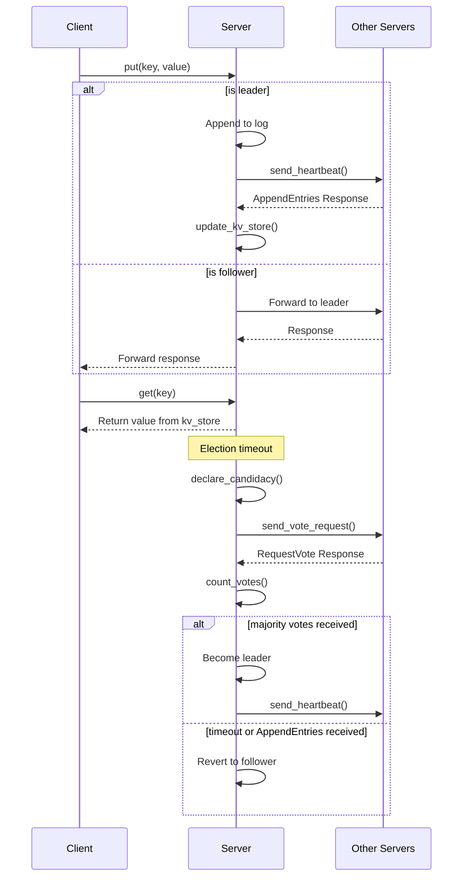

```mermaid
sequenceDiagram
    participant C as Client
    participant S as Server
    participant O as Other Servers

    C->>S: put(key, value)
    alt is leader
        S->>S: Append to log
        S->>O: send_heartbeat()
        O-->>S: AppendEntries Response
        S->>S: update_kv_store()
    else is follower
        S->>O: Forward to leader
        O-->>S: Response
        S-->>C: Forward response
    end

    C->>S: get(key)
    S-->>C: Return value from kv_store

    Note over S: Election timeout
    S->>S: declare_candidacy()
    S->>O: send_vote_request()
    O-->>S: RequestVote Response
    S->>S: count_votes()
    alt majority votes received
        S->>S: Become leader
        S->>O: send_heartbeat()
    else timeout or AppendEntries received
        S->>S: Revert to follower
    end
```